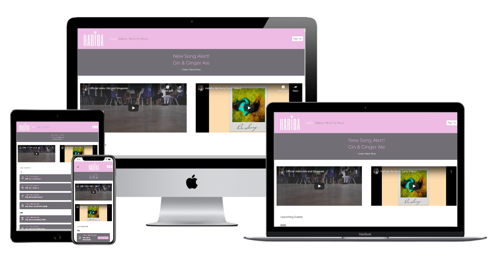
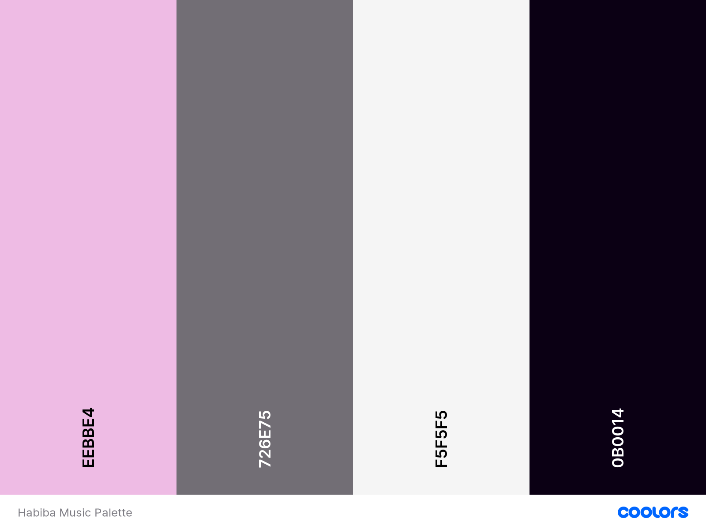

# Habiba Music
Habiba Music is to showcase Habiba, an up-and-coming UK R&B musician. The website will give new and existing fans the opportunity to hear her latest music and learn a bit more about her as an artist while being able to see upcoming shows and book tickets. The website was built mobile first and is responsive across all devices.

[Please see the deployed site here](https://marijoke.github.io/Milestone-project-Habiba/)
## UX
 This website is for existing and potential fans of Habiba. The website is to help Habiba build a relationship with fans by sharing images, music and information about her personal life. Visitors benefit from the ability to the sign up to the Habiba Music mailing list giving them exclusive access to her latest content and pre-sale tickets. 
I discussed the purpose of the website with the artist and spoke to a few fans which led me to the current build. Habiba wanted to keep the relationship she has with her fans as authentic as possible which is why there was a first-person biography included with the Music Monday videos Habiba creates for fun sometimes based on fan suggestions. 
The Home page must feature the most important content which in this case is the latest music and upcoming shows. During my research this was the most important for fans. The Gallery page was added as artist photos are popular amongst fans and were a popular feature on other artist pages within the same genre. The final page. Focuses on more on Habiba as an individual, her inspirations and the things she enjoys. This was the last page because designing mobile first forced me to chose what was the most important and put that first. The Modal Sign up in the Navigation Bar meant that it was always present across all pages just like the contact info in the footer. 
### Wireframes
I created the wireframes using [Balsamiq](https://balsamiq.com/)

[Please see Wireframes here.](https://photos.app.goo.gl/5LkurJPf9nQBc8Ts9)
### Fonts 
The fonts chosen for the website are [Montserrat](https://fonts.google.com/specimen/Montserrat?query=mont) for headings and [Raleway](https://fonts.google.com/specimen/Raleway?query=ralewa) for body text. The fonts are from Google fonts where they were recommended as a popular pairing. I chose Montserrat because the text is clean and clear yet warm and friendly which is what attracts Habiba’s fans to her and what represents her music well.
### Colours
The website was designed with the original branding in mind. Habiba’s logo is pink and white as is the aesthetic of her Instagram where I drew inspiration. I matched the Navigation bar and Footer to the logo and used [Coolers](https://coolors.co/) to come up with complimentary colours that are used throughout the website. 

## User Stories 
- As an existing fan, I want to hear Habiba’s latest music, get exclusive updates and access ticket pre-sales, so that I can keep my favourite playlist up to date, have updates on Habiba to share with my friends and see Habiba perform live.
- As a potential user, I want to know more about Habiba and check out some of her music, so I can decide if I like her music enough to maybe see her live or add her to my music library.

## Features
### Existing Features
- Collapsible Navigation menu – allows all users to easily access the menu when viewing from a small screen, by selecting the hamburger menu that allows users to navigate between pages.
- Modal sign-up – All interested fans can select the sign-up button in the Nav bar that pops up to avoid taking away from the page. Filling the form give the user exclusive contact.
- Footer – features contact information such as an email link and social media links to Habiba’s pages. 
- Events widget – allows interested users to see upcoming performance dates and click through to venue location and get tickets. 
- Mobile First design – allows users to view the website across multiple platforms without compromising usability.
- Gallery Page – allows users to see artist photos is a visually pleasing way.
- All images including the logo have alternative text or assistance for screen readers to ensure website is accessible. 
### Features Left to Implement
-	Future developments will have a video carousel on the home page
-	 Additional page featuring the lyrics and explanations inspired by [Genius](https://genius.com/) that allows the fans to get to know Habiba and develop a greater understanding of their favourite songs. 
## Technologies Used
- HTML5 
- CSS3
- [Bootstrap 4.5.3](https://getbootstrap.com/)
    - Used to simplify layouts and create consistency of design while enabling responsiveness. 
- [Balsamiq](https://balsamiq.com/)
    - Created Wireframes for the project prior to development
- [Elfsight](https://apps.elfsight.com/)
    - Create the upcoming events section on the homepage 
- [Github](https://github.com/) & [Gitpod](https://www.gitpod.io/)
    - Used to write, store and view code
- [Google fonts](https://fonts.google.com/)
    - Used [Montserrat](https://fonts.google.com/specimen/Montserrat?query=mont) and [Raleway](https://fonts.google.com/specimen/Raleway?query=ralewa) fonts as described earlier. 
- [Font awesome 4.7](https://fontawesome.com/icons?d=gallery)
    -Used for contact icons in the footer

## Testing
My Code was checked using both the [Markup Validation Service](https://validator.w3.org/#validate_by_input) and the [CSS Validation Service](https://jigsaw.w3.org/css-validator/). 

I also used the Google Developer tool Lighthouse to check my work website. The report for this can be found [here](https://photos.app.goo.gl/ndL6XfmxqCGEBXij9)

My project has responded well to testing in various browsers on across mulitple devices. 
- The project was tested in:
    - [Google Chrome](https://www.google.com/intl/en_uk/chrome/)
    - [Firefox](https://www.mozilla.org/en-GB/firefox/)
    - [Safari](https://www.apple.com/uk/safari/)
    - [Duck Duck go](https://duckduckgo.com/)

- The devices used to test are as follows
    - 12 inch Macbook
    - iPad air
    - iPad mini 
    - iPhone X 
    - iPhone 11
    - iPhone 8 Plus
    - 14 inch Microsoft laptop
    - 27 inch desktop monitor

- While testing I found that due to the wider screen on the 8 plus there was some cut off and misalignment of the footer. 

## Deployment

My project was deployed using GitHub Pages
-	While logged in to GitHub I located my project repository 
-	Selected settings
-	Scrolled to find GitHub Pages I selected Master as the source. 
-	Pressed save
-	After refreshing I revisited GitHub Pages in the settings and was able to click the link to see the site live. 

Local Deployment, run using Gitpod
-	Add the Gitpod browser extension on Google chrome
-	Login to your GitHub account
-	Locate the project repository and select the green Gitpod button which will open a workspace. 

### Bugs
The Bootstrap collapsible menu was not showing the preview. When selected in mobile mode nothing happened. After some assistance from my tutor the bootstrap CDN was updated and the menu was able to display properly in the previews.
Making the YouTube video responsive was a challenge. Thankfully, I found a [YouTube tutorial](https://www.youtube.com/watch?v=9YffrCViTVk&feature=emb_logo) that worked perfectly. 

The logo would not stay in the centre and adjusting any aspect of the box model was a temporary solution as it was not responsive. After trying to float the image and changing the position to relative of an absolute container with no luck, I got help from [W3schools.com](https://www.w3schools.com/howto/howto_css_image_center.asp).
## Credits
### Content 
-	Habiba Biography was written alongside the artist to ensure accuracy and tone of voice. 
- I used my [Love Running project](https://repl.it/@Marijoke/Love-Running#gallery.html) to help me create a gallery page.
- I used [Bootstrap](https://stackoverflow.com/questions/18474564/bootstrap-3-navbar-with-logo) to help with help the logo in the Navigation Bar
- [Readme template](https://github.com/Code-Institute-Solutions/readme-template/blob/master/README.md#existing-features) and a [peer example](https://github.com/adowlin/project-1-dungeons-dragons/blob/master/README.md) helped me write my Readme file.
### Media
- The photos used in this site were either taken by me or obtained from the artist herself. I have been granted permission to use them for the purpose of this project. Selected Photos are featured [here](https://photos.app.goo.gl/xAYMJZRdzJdymJRs7)
- YouTube Tutorial for responsive video [here](https://www.youtube.com/watch?v=9YffrCViTVk&feature=emb_logo)
- [Classy Nemesis](https://www.classynemesis.com/projects/ytembed/) was used to add auto play and change a few of the colours on the YouTube iframe. Auto play was later removed after user feedback.
- [Elfsight](https://apps.elfsight.com/panel/applications/) was used to build the upcoming events calendar
- [Font Awesome](https://fontawesome.com/icons?d=gallery) for the footer icons 
- Youtube Videos were sent via private link from the artist or located on [Habiba’s YouTube page](https://www.youtube.com/c/HabibaAdamu/videos)
### Acknowledgements
- I worked closely with the artist to ensure I was creating something that she felt suited her brand.
- I used Slack to help troubleshoot issues I had as well as many google searches. 
- My Tutor Spencer for patiently giving me his time to help me work through any issues
- My mother for making sure I eat when I get too carried away with work.
- Habiba & her fans for helpful feedback.
- I received inspiration for the website from other artist sites like [Summer Walker](https://www.summerwalkermusic.com/) and [H.E.R](https://www.her-official.com/home/). 
I used the website to help me decide what features to have and what features I did not like.
